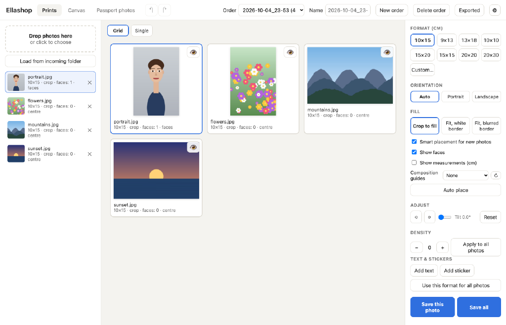
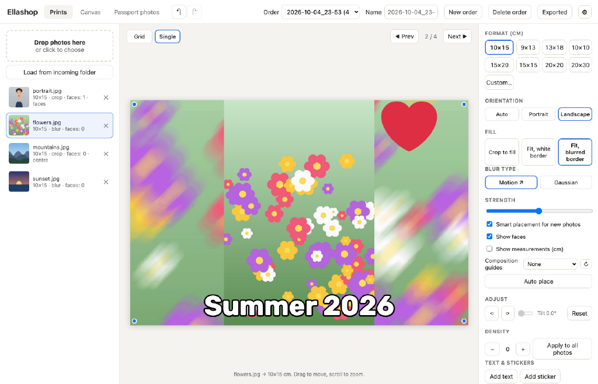
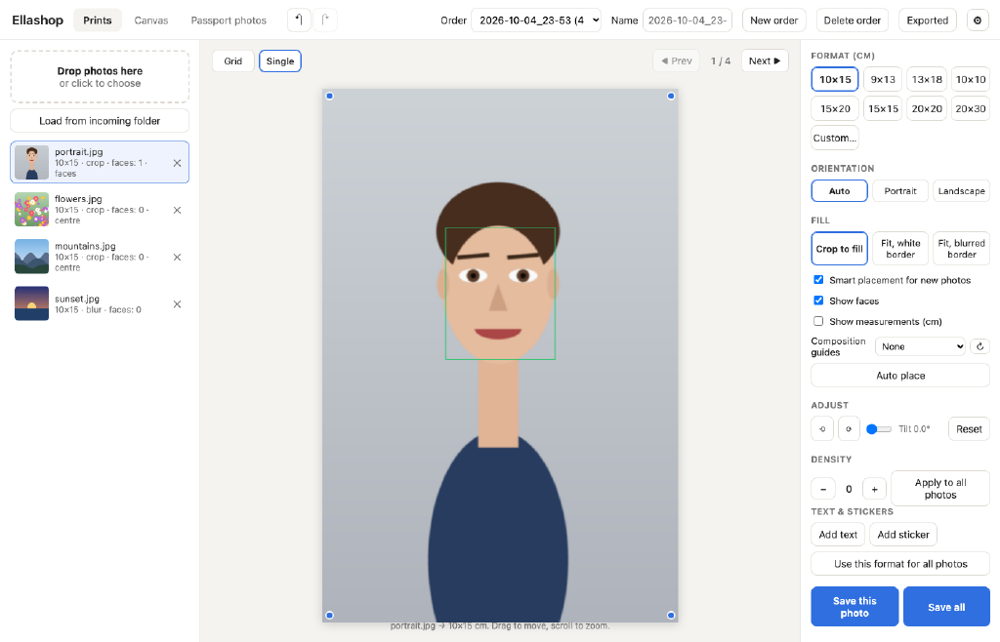
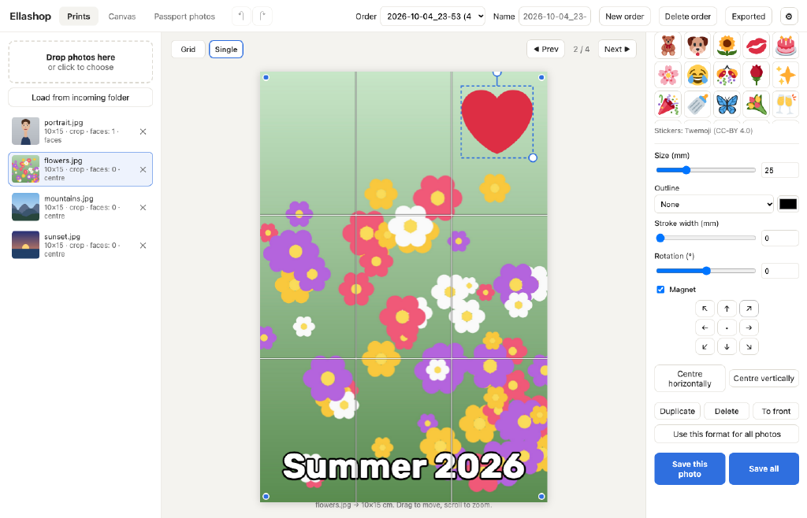
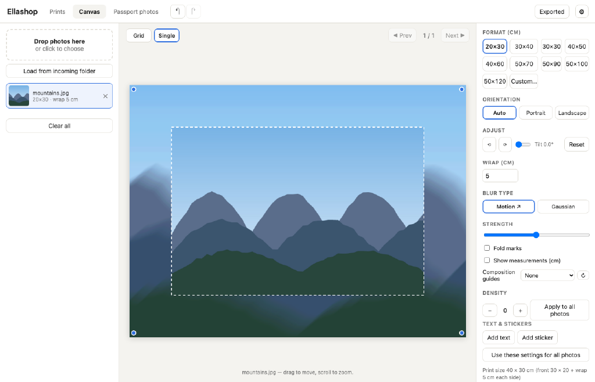
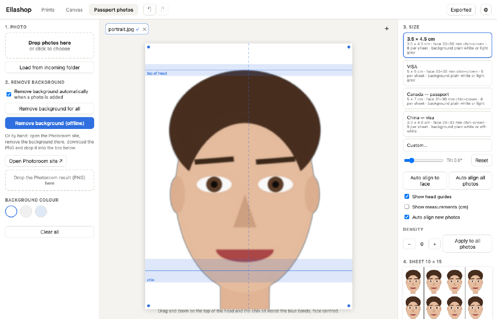
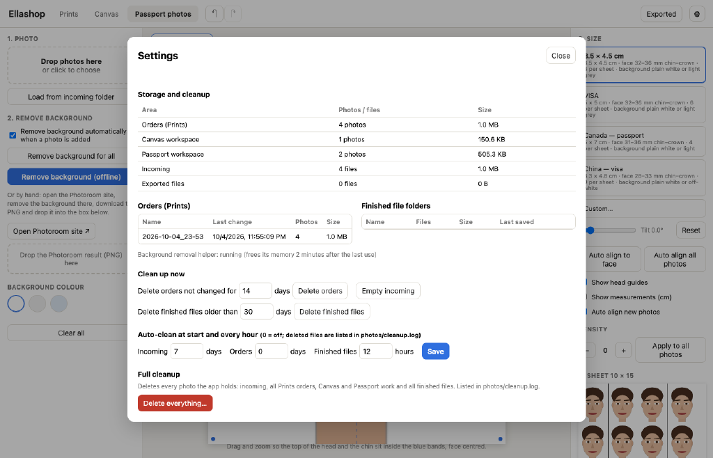

# Ellashop

**A photo editor for photo-printing shops.** Crop customer photos to print sizes, make
gallery-wrap canvases, and produce passport and visa photo sheets ready for the cutter —
with face recognition, offline background removal, and a small text & sticker editor.
It runs locally on a Mac or a Windows PC, works offline, and keeps every order on your disk.

## What it does

| Mode | For | Output |
|---|---|---|
| **Prints** | Regular photo prints: 10×15, 9×13, 13×18, 10×10, 15×20, 15×15, 20×20, 20×30 cm or any custom size | 300 DPI JPEG per photo |
| **Canvas** | Gallery-wrap canvases: 20×30 … 50×120 cm or custom, with a blurred wrap around the frame | 150 DPI JPEG, front + wrap |
| **Passport photos** | Passport / visa / ID photos: 3.5×4.5, VISA 5×5, Canada 5×7, China 3.3×4.8 or custom | 10×15 sheet, packed for a guillotine cutter |
| **Collage** | Place different photos in equal, fixed-size, shaped, or custom cells on a printed sheet | 300 DPI JPEG per sheet |

Prints, Canvas and Passport also include face recognition and smart crop placement, offline
background removal, a text & sticker editor, rulers and composition guides. All workspaces
support undo/redo and automatic clean-up of old files.

## Install and run

### Mac
1. Install **Python 3.12** from [python.org](https://www.python.org/downloads/) (once; 3.11 or newer is required).
2. Download Ellashop: the green **Code → Download ZIP** button on GitHub (then unzip), or
   `git clone https://github.com/OleksiiFetsenets/ellashop.git`.
3. Double-click **`app/setup_offline_bg.command`** once. It installs the Python packages, the app
   window, offline background removal and the face-recognition model (a few minutes).
   If macOS says the file can't be opened, right-click it → **Open**.
4. Double-click **`Ellashop.command`** to start. Ellashop opens in its own window; closing the
   window stops it. Photos are kept in the `photos/` folder next to the app.

The first background removal downloads the AI model once (~930 MB); after that everything works offline.

### Windows
1. Open the [Releases page](https://github.com/OleksiiFetsenets/ellashop/releases) and download
   **`Ellashop-Setup-<version>.exe`**.
2. Run it. The installer is not code-signed, so Windows may show "Windows protected your PC" —
   click **More info → Run anyway**. No administrator rights are needed.
3. Start **Ellashop** from the desktop or Start menu. Photos are kept in `Documents\Ellashop`.

The installer contains everything (Python, the libraries, the background-removal and face models),
about 1 GB to download and ~1.3 GB installed. To build the installer yourself, see
[`windows/README.md`](windows/README.md).

## Prints

Add photos by dragging them in, choosing them, dropping a `.zip`, or loading from the `incoming`
folder. Several photos open in a **grid**: click a card to select it, the 👁 opens it large.
Pick a size, drag to move the crop, scroll or +/− to zoom, arrows to nudge, Shift+←/→ to straighten.

Fill modes:
- **Crop to fill** — the photo fills the print.
- **Fit, white border** — the whole photo, with white borders.
- **Fit, blurred border** — the whole photo, with the borders filled by a blurred copy of itself:

**Save this photo** / **Save all** write 300 DPI JPEGs (e.g. `photo_10x15.jpg`) into the order's
folder under *Exported*. **Density** (−/+) lightens or darkens a photo for the printer, per photo or
for all.

### Face recognition and smart placement
Ellashop finds faces (OpenCV YuNet, offline) and places each crop so heads stay inside the print —
cropping legs and hands rather than heads. When the faces can't fit the chosen size, it switches to a
blurred border instead of cutting someone off. **Show faces** draws what it found; **Auto place**
redoes the placement after manual changes.

### Orders
Prints work is organised in **orders** (top bar): create, name, switch and delete them. Each order
keeps its photos and edits, even after restarting the app, and saves its prints into its own folder.
When the app starts and the last session left photos behind, it asks **Continue where you left off?**
— Continue keeps everything, Start fresh opens empty tabs and a new order.

## Text & stickers — the minimal editor

In Prints or Canvas, open a photo large and use **Text & stickers**: add text or one of the stickers,
drag it, resize and rotate it with the handles. Text has fonts, colour, outline, letter spacing and
wraps automatically; stickers can get a die-cut outline. Items snap to the centre, the edges, a 5 mm
safe margin and each other (hold Alt to move freely), and the arrow buttons align them in one click.
They stay fixed to the print while the photo underneath moves.

Fonts: Ella, Mila, Janna, Regina, Idan, Oleksii and Liam (open-source fonts in `app/static/fonts/`,
renamed in the menu).

## Canvas

Choose the canvas size and the wrap width (default 5 cm). The sharp photo goes on the front and the
sides are filled with a blurred enlargement of it — diagonal motion blur or Gaussian — so the picture
continues around the frame. Optional fold marks; measurements show the whole sheet including the wrap.

## Passport photos

1. Load the photo (several at once each get their own tab).
2. The background is removed automatically and offline (BiRefNet), or by hand with the Photoroom
   website (drop the downloaded PNG in). Choose white, light grey or light blue.
3. Choose the document. The head is **aligned automatically**: the chin and the top of the head are
   placed inside the blue bands required for that document (e.g. 32–36 mm for 3.5×4.5).
   Drag, zoom or straighten to fine-tune.
4. **Save sheet** — the photos are packed from the top-left corner of a 10×15 sheet with thin black
   cut lines and no gaps, ready for a guillotine cutter (8 × 3.5×4.5, 6 × VISA, 4 × 5×7, 9 × 3.3×4.8).

## More

- **Custom size** — every mode has **Custom…**: type the width and height in cm.
  Custom passport sizes get head guides at 70–80 % of the photo height.
- **Undo / redo** — ↶ ↷ in the top bar, ⌘Z / ⇧⌘Z on Mac, Ctrl+Z / Ctrl+Y on Windows; each tab
  keeps its own history.
- **Measurements and composition guides** — centimetre rulers, rule of thirds, golden ratio,
  Fibonacci spiral, diagonals, golden triangles, perspective (on screen only, never printed).
- **Exported** opens the folder with the finished files.
- **Updates** — when a new version is published, an **Update** button appears in the top bar;
  updating replaces only the program files, never photos or settings. The Windows installer has this
  switched on; on a Mac, create `app/update.json` containing `{"repo": "OleksiiFetsenets/ellashop"}`.

## Storage and clean-up

The **⚙** button shows how much space orders, workspaces, incoming photos and finished files take,
and cleans them up:
- **Auto-clean** runs at start-up and every hour: finished files older than **12 hours**, incoming
  photos older than 7 days (orders: off). Change the numbers in Settings; 0 turns a rule off.
- **Clean up now** deletes old orders, incoming photos or finished files on demand.
- **Delete everything…** (full clean-up) removes every photo the app holds after a confirmation.
- Every deleted file is listed in `photos/cleanup.log`.

Where files live (Mac: `photos/` next to the app; Windows: `Documents\Ellashop`):

| Folder | Contents |
|---|---|
| `incoming/` | photos and unzipped archives waiting to be loaded |
| `orders/` | Prints orders: source photos and edits |
| `workspace/` | Canvas and Passport work in progress |
| `print_ready/` | finished files ("Exported"), grouped by order, canvas size or passport size |

## For developers

- Stack: a small Python server (`app/server.py`, standard library + OpenCV, rembg/onnxruntime) and a
  plain JavaScript single-page UI shown in a native window by pywebview (`app/desktop.py`).
  `python3 app/server.py` runs it in the browser instead.
- The UI scripts in `app/static/js/` load in this order (one shared scope): `config` → `render` →
  `history` → `orders` → `ui` → `editor` → `tabs` → `settings` → `prints` → `canvas` → `passport` →
  `shortcuts` → `main`. Every file starts with a comment describing its role.
- Releases: bump `VERSION`, then `git tag vX.Y.Z && git push --tags`. GitHub Actions builds the
  Windows installer and the code-only update zip and attaches them to the release
  (`.github/workflows/windows-installer.yml`, details in `windows/README.md`).

## Credits and license

Ellashop is released under the [MIT License](LICENSE).

- Background removal: [rembg](https://github.com/danielgatis/rembg) with the BiRefNet portrait model.
- Face detection: [YuNet](https://github.com/opencv/opencv_zoo) (OpenCV Zoo).
- Fonts: Rubik, Amatic SC, Bona Nova, M PLUS Rounded 1c, Rubik Bubbles, Tinos and Playpen Sans Hebrew —
  SIL Open Font License; licence files in `app/static/fonts/`.
- Stickers: [Twemoji](https://github.com/jdecked/twemoji), CC-BY 4.0.
- Screenshots use generated sample images.
